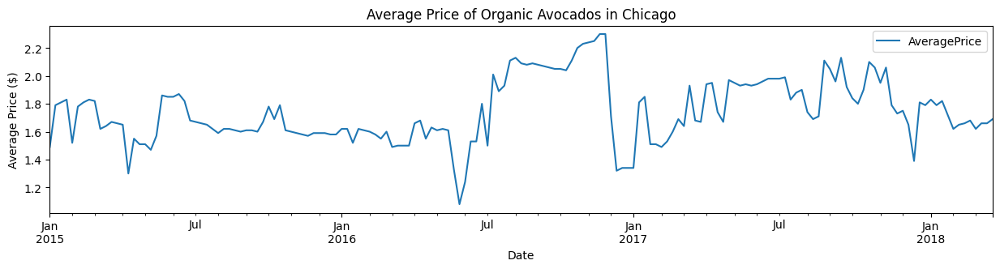
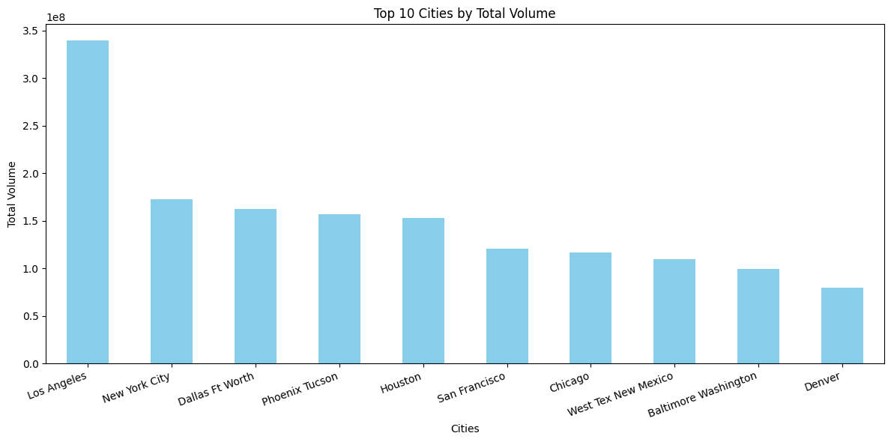

# Data Science and Computer Programming Final Project

Catagory: Exploratory Data Analysis\
Dataset link: https://www.kaggle.com/datasets/pedroisrael/avocado-sales/data

# Objectives

**Analyze avocado sales and prices from the provided dataset.**

1. Focus on organic avocados in the Chicago area.
2. Show the overall daily average price trend across all cities.
3. Compare price trends between organic and conventional avocados.
4. Identify top 10 cities by total sales and visualize them.

> Each objective is visualized in one figure (four figures total).

# Algorithms to accomplish the goal

1. **Data Loading and Parsing**
   Load the dataset and convert the date field into a proper datetime format. Ensure all numeric fields, such as `AveragePrice`, is correctly interpreted.

2. **Missing Values Checking**
   Since this dataset has cleaned, so there's no missing values need to be handle.

3. **Filtering for Organic Avocados in Chicago**
   Extract the subset of data corresponding to organic avocados sold specifically in the `Chicago` city to support the first visualization.

4. **Computation of Daily Average Prices Across Cities**
   Group data by `date` and compute the overall average price for all cities. Optionally apply a smoothing technique such as a moving average to reveal long-term trends.

5. **Comparison Between Organic and Conventional Avocado Prices**
   Aggregate price data by `date` and by avocado `type`. Align the two series to allow a direct temporal comparison and generate a visualization of their trends.

6. **Determination of Top-Selling Cities**
   Calculate total sales for each city using `Total Avocados` cloumn. Rank cities based on this metric and select the top ten for visualization.

# Visualization

1. Filtering information on organic avocados in the Chicago area

> This line chart illustrates the weekly Average Price of Avocados in Chicago from early 2015 to early 2018, showing significant volatility, particularly large price spikes around mid-2016 and again in 2017. The price ranges from just over \$1.10 to approximately \$2.30, indicating a wide fluctuation in the local organic market over the three-year period.

2. Calculate the average price for all regions daily and plot the overall price trend.

> This chart displays the Overall Avocado Average Price Trend over the same period (2015 to early 2018), representing a broader or national average, which is much smoother than the Chicago organic data. The overall average price is generally lower, ranging from about \$1.15 to just under \$1.90, and shows a clear, sustained upward trend culminating in a peak in late 2017 before declining into 2018.

3. Compare the average price trends of organic avocados and conventional avocados.

> The chart shows that organic avocados maintained a higher price than conventional avocados throughout the period, with both exhibiting seasonal fluctuations. Organic avocado prices fluctuated less, while conventional avocado prices were more susceptible to supply and demand changes. Both types of avocado prices saw significant peaks around Sep. 2017, reflecting tight market supply at the time.

4. Calculate the total sales for each city, identify the top 10, and create a bar chart

> Los Angeles' total sales far exceeded those of other cities, roughly double that of second-place New York City. This reveals LA as the largest avocado market in the US, which aligns with common sense (California residents truly love avocados).
>
> While New York City is second, there's a significant gap compared to Los Angeles. The third to seventh places (Dallas F. Worth, Phoenix Tucson, Houston, San Francisco, and Chicago) are relatively close, representing a "mid-sized market."
>
> West Mexico, Baltimore Washington, and Denver have significantly lower total sales than the top cities, indicating a long-tail distribution of the avocado market with a gradual decline in smaller cities.